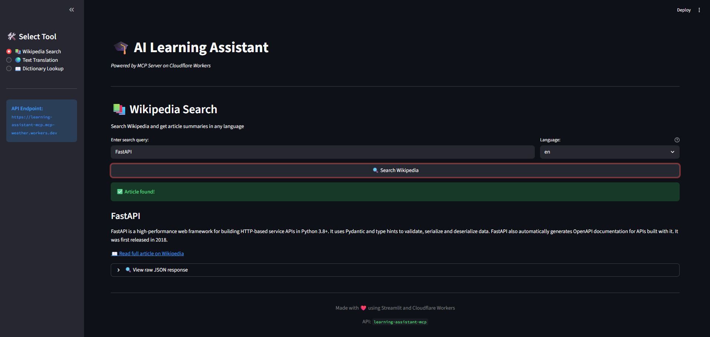
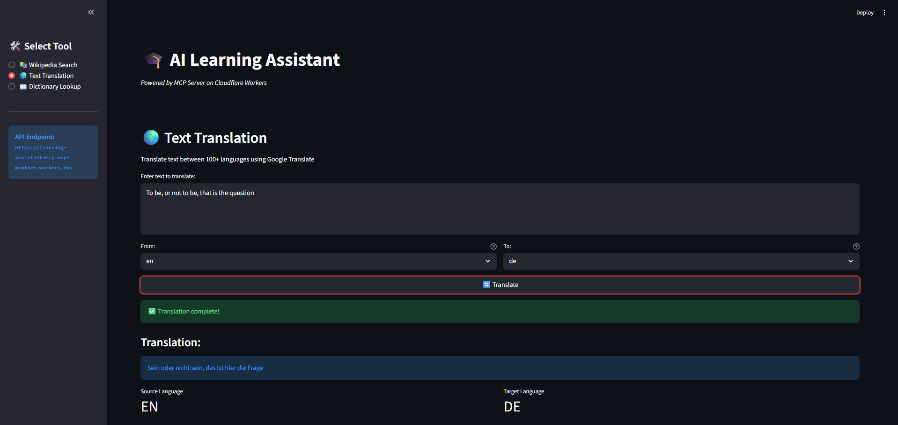
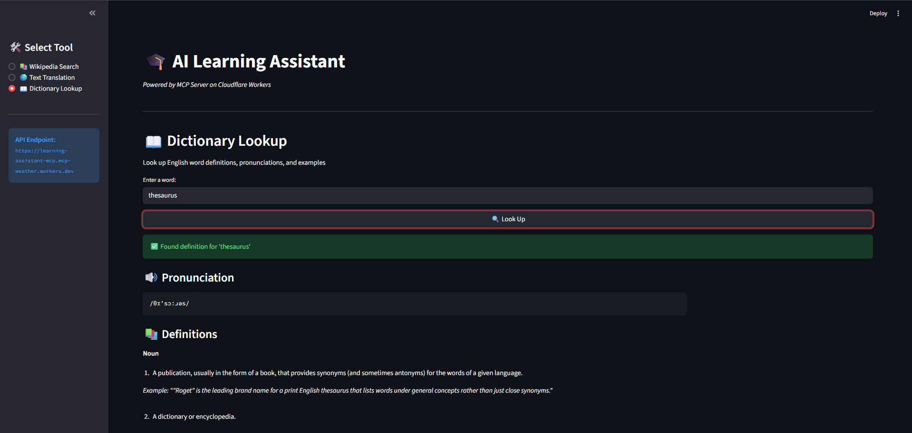

# 🎓 AI Learning Assistant

A complete learning platform consisting of an MCP (Model Context Protocol) server deployed on Cloudflare Workers and a beautiful Streamlit frontend interface.

[](LICENSE)
[](https://learning-assistant-mcp.mcp-weather.workers.dev)
[](https://workers.cloudflare.com/)
[](https://www.typescriptlang.org/)
[](https://www.python.org/)
[](https://github.com/astral-sh/uv)
[](https://streamlit.io/)
[](https://github.com)

## 🌟 Features

### 📚 Wikipedia Search
Search Wikipedia articles in multiple languages and get concise summaries with thumbnails and links.

### 🌍 Text Translation
Translate text between 100+ languages using Google Translate API.

### 📖 Dictionary Lookup
Look up English word definitions, pronunciations (with audio), examples, synonyms, and antonyms.

---

## 🏗️ Architecture

```
┌─────────────────────────────────────┐
│   Streamlit Frontend (Python)       │
│   - User Interface                  │
│   - Visual Components               │
│   http://localhost:8501             │
└──────────────┬──────────────────────┘
               │ HTTP POST
               ▼
┌─────────────────────────────────────┐
│   MCP Server (TypeScript)           │
│   - Tool Registry                   │
│   - API Integrations                │
│   Cloudflare Workers                │
└─────────────────────────────────────┘
```

---

## 📂 Project Structure

```
learning-assistant-mcp/              # Root directory
├── src/
│   ├── index.ts                     # Main server & routing
│   └── tools/
│       ├── wikipedia.ts             # Wikipedia search tool
│       ├── translate.ts             # Translation tool
│       └── dictionary.ts            # Dictionary lookup tool
├── learning-assistant-ui/           # Streamlit Frontend
│   ├── app.py                       # Main Streamlit app
│   ├── requirements.txt             # Python dependencies
│   └── .venv/                        # Virtual environment (gitignored)
├── screenshots/                     # UI screenshots for README
├── wrangler.toml                    # Cloudflare config
├── package.json                     # Node dependencies
├── tsconfig.json                    # TypeScript config
├── .gitignore                       # Git ignore rules
└── README.md                        # This file
```

---

## 🚀 Quick Start

### Prerequisites
- Node.js 18+ (for MCP server)
- Python 3.11+ (for Streamlit UI)
- npm or pnpm
- uv (Python package installer)
- Cloudflare account (for deployment)

### 1. MCP Server Setup

```bash
# Navigate to project root
cd learning-assistant-mcp

# Install dependencies
npm install

# Run locally
npm run dev

# Test the API
npm test

# Deploy to Cloudflare Workers
npm run deploy
```

### 2. Streamlit UI Setup

```bash
# Navigate to UI directory (from project root)
cd learning-assistant-ui

# Create virtual environment with uv
uv venv

# Activate venv
# Windows (Git Bash):
source .venv/Scripts/activate
# Linux/Mac:
source .venv/bin/activate

# Install dependencies with uv
uv pip install -r requirements.txt

# Run Streamlit app
streamlit run app.py
```

The app will open automatically at `http://localhost:8501`

---

## 🖼️ Screenshots

### Wikipedia Search Interface

*Search Wikipedia articles in any language with instant summaries*

### Translation Tool

*Translate text between 100+ languages with source and target language selection*

### Dictionary Lookup

*Get definitions, pronunciations with audio, examples, and synonyms*

---

## 🔧 API Usage

### Endpoint
```
Production: https://learning-assistant-mcp.mcp-weather.workers.dev
Local: http://localhost:8787
```

### Request Format
```json
{
  "tool": "toolName",
  "input": {
    // tool-specific parameters
  }
}
```

### Example Requests

#### Wikipedia Search
```bash
curl -X POST https://learning-assistant-mcp.mcp-weather.workers.dev \
  -H "Content-Type: application/json" \
  -d '{
    "tool": "searchWikipedia",
    "input": {
      "query": "Machine Learning",
      "language": "en"
    }
  }'
```

#### Translation
```bash
curl -X POST https://learning-assistant-mcp.mcp-weather.workers.dev \
  -H "Content-Type: application/json" \
  -d '{
    "tool": "translateText",
    "input": {
      "text": "Hello, world!",
      "sourceLang": "en",
      "targetLang": "pl"
    }
  }'
```

#### Dictionary Lookup
```bash
curl -X POST https://learning-assistant-mcp.mcp-weather.workers.dev \
  -H "Content-Type: application/json" \
  -d '{
    "tool": "lookupWord",
    "input": {
      "word": "serendipity"
    }
  }'
```

### Response Format
```json
{
  "success": true,
  // tool-specific response data
  "timestamp": "2025-11-04T05:34:31.266Z"
}
```

---

## 🛠️ Technologies Used

### Backend (MCP Server)
- **TypeScript** - Type-safe code
- **Cloudflare Workers** - Serverless edge computing
- **Zod** - Schema validation
- **Wrangler** - Cloudflare CLI

### Frontend (Streamlit UI)
- **Streamlit** - Python web framework
- **Requests** - HTTP client
- **Python 3.11+** - Runtime
- **uv** - Fast Python package installer

### APIs Integrated
- **Wikipedia REST API** - Article summaries
- **Google Translate API** - Text translation
- **Free Dictionary API** - Word definitions

---

## 📊 Performance

- ⚡ **Edge Computing** - Deployed on Cloudflare's global network
- 🚀 **Low Latency** - Average response time < 200ms
- 🌍 **Global Availability** - 275+ cities worldwide
- 💰 **Cost Efficient** - Free tier supports 100k requests/day

---

## 🧪 Testing

### Test MCP Server Locally
```bash
# From project root
npm run dev

# In another terminal
npm test
```

### Test with Custom Requests
```bash
# Test Wikipedia
curl -X POST http://localhost:8787 \
  -H "Content-Type: application/json" \
  -d '{"tool": "searchWikipedia", "input": {"query": "Python"}}'

# Test Translation
curl -X POST http://localhost:8787 \
  -H "Content-Type: application/json" \
  -d '{"tool": "translateText", "input": {"text": "Hello", "sourceLang": "en", "targetLang": "pl"}}'

# Test Dictionary
curl -X POST http://localhost:8787 \
  -H "Content-Type: application/json" \
  -d '{"tool": "lookupWord", "input": {"word": "hello"}}'
```

---

## 📝 Adding New Tools

### 1. Create Tool File
```typescript
// src/tools/your-tool.ts
import { z } from "zod";

export const yourToolInputSchema = z.object({
  param: z.string(),
});

export type YourToolInput = z.infer<typeof yourToolInputSchema>;

export const yourTool = {
  name: "yourTool",
  description: "What your tool does",
  inputSchema: yourToolInputSchema,
  
  async handler(input: YourToolInput) {
    // Your implementation
    return {
      success: true,
      // your response data
    };
  },
};
```

### 2. Register Tool in `src/index.ts`
```typescript
import { yourTool } from "./tools/your-tool";

const tools = {
  searchWikipedia: wikipediaTool,
  translateText: translateTool,
  lookupWord: dictionaryTool,
  yourTool: yourTool, // Add here
};
```

### 3. Test and Deploy
```bash
npm run dev    # Test locally
npm run deploy # Deploy to production
```

---

## 🌐 Deployment

### Deploy MCP Server to Cloudflare
```bash
# From project root
wrangler deploy
```

### Deploy Streamlit UI to Streamlit Cloud
1. Push code to GitHub
2. Go to [share.streamlit.io](https://share.streamlit.io)
3. Connect your repository
4. Select `learning-assistant-ui/app.py` as main file
5. Deploy!

---

## 🔐 Environment Variables

### MCP Server
No API keys required - all services use free public APIs.

### Streamlit UI
Update `API_URL` in `app.py` if deploying to custom domain:
```python
API_URL = "https://your-custom-domain.workers.dev"
```

---

## 🤝 Contributing

Contributions are welcome! Please follow these steps:

1. Fork the repository
2. Create a feature branch (`git checkout -b feature/AmazingFeature`)
3. Commit your changes (`git commit -m 'Add some AmazingFeature'`)
4. Push to the branch (`git push origin feature/AmazingFeature`)
5. Open a Pull Request

---

## 📄 License

This project is licensed under the MIT License - see the [LICENSE](LICENSE) file for details.

---

## 🙏 Acknowledgments

- [Wikipedia API](https://www.mediawiki.org/wiki/API:Main_page) - Article data
- [Free Dictionary API](https://dictionaryapi.dev/) - Word definitions
- [Google Translate](https://translate.google.com/) - Translation service
- [Cloudflare Workers](https://workers.cloudflare.com/) - Serverless hosting
- [Streamlit](https://streamlit.io/) - Frontend framework

---

## 📧 Contact

- **GitHub**: [@takzen](https://github.com/takzen)
- **Project Link**: [https://github.com/takzen/learning-assistant](https://github.com/your-username/learning-assistant)
- **Live Demo**: [https://learning-assistant-mcp.mcp-weather.workers.dev](https://learning-assistant-mcp.mcp-weather.workers.dev)

---

Made with ❤️ using TypeScript, Python, and Cloudflare Workers